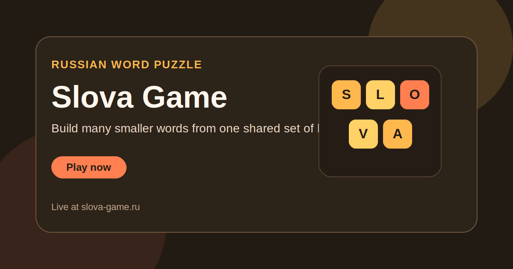

<h1 align="center">Slova Game</h1>

  A Russian word puzzle platform where players build smaller words from a larger base word directly in the browser.

  <a href="https://slova-game.ru/"><strong>Play Now</strong></a>
  ·
  <a href="https://github.com/ivanlukichev/SlovaGame"><strong>GitHub Repo</strong></a>
  ·
  <a href="https://github.com/ivanlukichev/SlovaGame/blob/main/russian-word-list-games"><strong>Word List</strong></a>

  

## What It Is

Slova Game turns a familiar pen-and-paper style word challenge into a browser puzzle platform. Each level is built around one source word, and the player tries to discover as many smaller valid words as possible using only those letters.

This public repository is both a showcase page for the product and a public access point for the underlying Russian word list used in the game.

## Why It Feels Different

- Every level creates a compact word-search challenge with clear boundaries.
- The product works as both a game and a searchable content structure.
- It is easy to start, but the combinatorics keep it replayable.
- The public repo gives useful data, not just marketing copy.

## Open Data

The repo includes the Russian word list that powers level generation and validation:

- Data file: [russian-word-list-games](https://github.com/ivanlukichev/SlovaGame/blob/main/russian-word-list-games)
- Scope: 38,387 Russian words
- Uses: word games, generators, validation tools, content experiments

## Project Snapshot

- Genre: word construction puzzle
- Language: Russian
- Stack: static front end
- Core mechanic: build valid smaller words from one base word
- Extra asset: reusable Russian word list

## More Projects

| Project | Live site | Public repo |
| --- | --- | --- |
| Goroda | [goroda-na.ru](https://goroda-na.ru/) | [Goroda-na](https://github.com/ivanlukichev/Goroda-na) |
| Word Chain Game | [word-chain-game.com](https://word-chain-game.com/) | [Word-Chain-Game](https://github.com/ivanlukichev/Word-Chain-Game) |
| PlayBlockGame | [playblockgame.ru](https://playblockgame.ru/) | [PlayBlockGame](https://github.com/ivanlukichev/PlayBlockGame) |
| Tic-Tac-Toe | [крестики-нолики.рф](https://крестики-нолики.рф/) | [---](https://github.com/ivanlukichev/---) |
| Solitaire | [играть-пасьянс.рф](https://играть-пасьянс.рф/) | [-](https://github.com/ivanlukichev/-) |
| Number Hunt | [numberhuntgame.com](https://numberhuntgame.com/) | [numberhuntgame](https://github.com/ivanlukichev/numberhuntgame) |
| CalcSprint | [calcsprint.com](https://calcsprint.com/) | [CalcSprint](https://github.com/ivanlukichev/CalcSprint) |
| PickWinner | [pickwinner.tools](https://pickwinner.tools/) | [pickwinner](https://github.com/ivanlukichev/pickwinner) |

## Visit

  <a href="https://slova-game.ru/"><strong>Open Slova Game</strong></a> 
  Browser-based Russian word puzzle backed by a reusable dictionary dataset.

